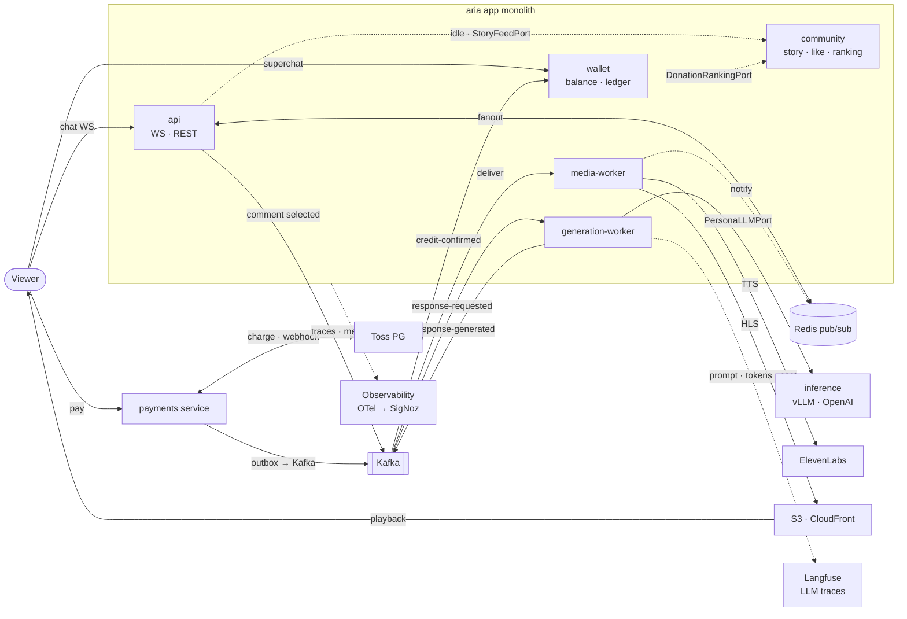

# architecture

aria(모노레포: 앱 모놀리스 + payments 서비스)의 구조와 근거. 이 repo의 설계 원본.

## 서비스 아키텍처

> GitHub이 위 Mermaid를 인라인 렌더. 렌더 이미지는 `docs/assets/architecture.png`, 소스는 `docs/assets/architecture.mmd`. 수정 후 `npx @mermaid-js/mermaid-cli -i docs/assets/architecture.mmd -o docs/assets/architecture.png -s 2`로 재렌더.

## 배포 단위 (모노레포 + 최소 MSA)

| 단위 | 무엇 | 배포 | 왜 이 경계 |
|---|---|---|---|
| **aria 모놀리스** | contexts: identity·persona·community·chat·streaming·wallet | api / generation-worker / media-worker (같은 이미지) | 워커로 독립 스케일. wallet은 후원 핫패스라 여기 |

> **generation-worker는 실체가 있다**(C-4-1). 진입점 `aria/workers/generation.py`, 실행은 `uv run faststream run aria.workers.generation:app`. api와 같은 이미지에 진입점만 다르며, 같은 consumer group 안에서 복제본을 늘리는 것이 곧 수평 확장이다. **합성 루트가 둘**인 셈인데(`app.py`와 여기), 둘 다 common과 컨텍스트를 함께 아는 자리라 common 밖 최상위에 둔다. media-worker는 아직 없다.
>
> **idle 워커가 셋째 진입점이다**(`aria/workers/idle.py`, 실행 `uv run python -m aria.workers.idle`). 무채팅이 지속되면 사연을 읽거나 자율발화한다(FR-IDLE). FastStream은 메시지가 와야 깨어나므로 generation-worker에 합치지 않았다 — idle은 정반대로 "아무 일도 없을 때" 도는 타이머다.
>
> **이 워커는 DB를 안다**(방 목록·사연). "워커는 DB를 모른다"는 generation-worker의 규칙이고, idle 워커는 생성을 하지 않고 **요청만 발행**하므로 그 경계와 충돌하지 않는다.

> **수평 확장은 실측했다**(C-4-2). 실제 Kafka에서 워커 2인스턴스가 3개 파티션을 나눠 갖고 30건을 각각 23/7 처리 — 합계 30, 중복 0. 배달 보증(토픽별 ack·`msg_id` claim·DLQ)은 어댑터가 입히고 `ResponseGenerationService`는 그런 게 있는 줄 모른다. 정책은 `docs/events.md`.
| **payments 서비스** | Toss 결제 saga · outbox | 별도(별도 DB) | 경계가 이미 async, 보안/장애 격리 |
| **inference 서빙** | vLLM 멀티-LoRA | 별도 repo(GPU) | GPU 하드 경계 |
| **llmops** | 데이터셋→SFT→DPO→평가→레지스트리 | 별도 repo(GPU) | 배치·GPU |

**추출 브라이트라인**: 다른 런타임(GPU) 또는 자연 async + 강한 격리 — 이 둘만 서비스. 나머지는 프로세스 타입 스케일.

## 레이어 (Hexagonal-Lite, 컨텍스트별 수직 슬라이스)

각 컨텍스트가 자기 `domain / application(+port) / adapter`를 가진다. `common`은 공유 커널(설정·DB/Redis 클라이언트·인증(`auth`)·예외·SQLModel 믹스인·`EventBusPort`). 컴포지션 루트는 `common` 밖 `aria/app.py`(패키지 최상위)에 둔다 — common이 컨텍스트를 import하지 않도록.

`import-linter`(`apps/aria/.importlinter`)가 강제:
- 컨텍스트 내 `domain < application < adapter`
- 컨텍스트 간 **독립**(직접 import 금지, 경유는 `common` 이벤트/포트)
- `common`은 컨텍스트를 import하지 않음(커널 순수성)

`in`이 예약어라 필요 시 adapter 하위는 `inbound`/`outbound`.

### 컨텍스트 상호작용 규약

컨텍스트는 서로 import하지 않는다. 공유가 필요하면 성격에 따라 셋 중 하나로 올린다.

- **횡단 관심사 → `common`.** 인증(authN)이 대표 예: `common/auth.py`가 Bearer 토큰을 검증해 `Principal(user_id, is_staff)`를 돌려준다. 어느 컨텍스트든 identity를 몰라도 "누가 요청했나"를 얻는다. 토큰 **발급은 identity**(로그인), **검증은 common** — 같은 secret, 책임 분리.
  > **관리자 여부는 토큰 클레임(`staff`)이다.** DB에서 매번 조회하려면 common이 identity를 import해야 하는데 커널 순수성 계약이 그것을 금지한다. 기존 분업(발급=identity, 검증=common) 위에 클레임 하나를 얹는 것이 유일하게 계약을 지키는 길이다. 대가는 **권한 회수가 토큰 만료 시점에 반영**된다는 것. 관리자 전용 엔드포인트는 `require_staff` 의존성을 쓴다(예: `POST /wallet/grants`).
- **단순 참조 → 불투명 id.** 다른 컨텍스트의 엔티티는 UUID로만 참조한다(예: `persona.owner_id` = identity의 user id). 전체 객체를 끌어오지 않고, **DB에서도 cross-context FK를 걸지 않는다**(인덱스만) — 독립을 물리 스키마까지.
- **진짜 협력 → 이벤트 또는 포트.** 상태 변화 **통지**는 Kafka(`EventBusPort`)로(예: payments→wallet). 반면 즉시 답이 필요하거나(후원 차감) 조회 시점의 질문인 것(사연 claim, 열혈순위)은 **커널에 둔 동기 포트**로 한다 — 계약이 `common`에 있으면 이벤트든 포트든 컨텍스트 독립은 똑같이 지켜진다. 어느 쪽인지의 판단 근거는 `docs/events.md`.

합성 루트(`aria/app.py`)만이 common과 모든 컨텍스트를 함께 안다 — 그게 합성 루트의 일이라 common 밖 최상위에 둔다.

## 방(Room) — chat의 애그리게이트

한 페르소나의 방송 한 회차다. 채팅·후원·생성이 전부 그 위에서 일어나고, idle 루프와 미디어 송출(`hls_url`)도 이것을 전제로 한다.

- **개설은 staff 전용.** chat은 persona를 import할 수 없어 "이 페르소나가 당신 것인가"를 확인할 수 없다. 커널 포트를 하나 더 만드는 대신 PRD FR-AUTH-3("관리자는 방송·페르소나·TTS 설정을 관리한다")을 근거로 좁혔다 — 일반 사용자 호스트를 열게 되면 그때 `PersonaOwnershipPort`가 필요해지고, 그건 요구사항이 바뀌는 시점이다.
- **채팅·후원·WS는 라이브 방에서만.** 방이 생기기 전에는 `room_id`가 아무 UUID나 됐고, 그래서 존재하지 않는 방에 크레딧을 태울 수 있었다(차감은 진짜로 일어났다).
- 상태·유일성 규칙은 `docs/data-model.md`.

> 이로써 **chat api가 처음으로 DB를 갖는다**(그전까지 Redis만 썼다). 다만 **generation-worker는 계속 DB를 모른다** — 방 검증은 api에서만 하고 워커는 슬롯·생성·발행만 한다. C-4에서 세운 경계가 유지된다.

## 커뮤니티(방송국) 컨텍스트

`community` = 스트리머별 팬덤 채널의 UGC(사연 게시판·좋아요·랭킹). `persona`(AI 캐릭터 설정)와 바뀌는 이유가 달라 별도 컨텍스트.
- **Story(사연)** 는 `community`가 소유(게시판 CRUD). `chat`의 idle은 직접 import 없이 **읽기 포트/이벤트**로 pending 사연을 소비(FR-STATION-4 → FR-IDLE-2).
- **랭킹(열혈순위)** 은 테이블 없는 파생 read model이다(FR-STATION-6). 후원 금액은 `wallet`이, 후원자 표시명은 `identity`가 갖고 있고, community는 조회 시점에 둘을 합쳐 순위표를 만든다 — 직접 import 없이 커널의 **동기 읽기 포트** `DonationRankingPort`·`UserDirectoryPort`로. 배선은 합성 루트.

> 처음에는 "후원 이벤트 기반 read model"로 적어 두었으나, 그러려면 community가 자체 집계 테이블을 두고 이벤트로 갱신해야 한다. 후원은 저볼륨이고 집계는 인덱스 하나로 끝나므로, 갱신 누락이라는 정합성 문제를 새로 만들 이유가 없다. 비용은 조회 앞의 TTL 캐시가 받는다(`docs/events.md`).

## 앱 ↔ 추론 경계

`PersonaLLMPort`(`contexts/chat/application/port/out/llm.py`)가 유일한 접점. 앱은 `persona_id`만 넘기고 모델 버전을 모른다 — 버전 해석은 경계 너머 레지스트리 alias. 어댑터는 `contexts/chat/adapter/outbound/inference`. OpenAI fallback도 같은 포트 뒤.

추론 3역할(모두 OpenAI 호환 → 같은 어댑터, URL 스왑): 운영=vLLM(멀티-LoRA), fallback·로컬 dev=OpenAI, 학습·평가=transformers+trl+peft(별도 repo).

## 메시징 — 성격이 다른 둘

| | 채팅 팬아웃 | durable 이벤트 (LLM·미디어 seam · payments↔wallet) |
|---|---|---|
| 수단 | **Redis pub/sub** | **Kafka + FastStream** (`EventBusPort` 뒤) |
| 성격 | 저지연·고빈도·유실 허용 | durable·at-least-once·consumer group·outbox |

payments→wallet은 **outbox 패턴**(결제확정 + outbox 로우 로컬 트랜잭션 → relay가 Kafka 발행 → wallet 멱등 소비). 상세: `docs/events.md`.

## 실시간 송출 — 서버합성 HLS

미디어는 서버합성 HLS + CDN. media-worker가 TTS + 감정별 클립 + 자막을 ffmpeg로 muxing → HLS 세그먼트. 시청자 수가 CDN으로 이관(레거시 "100명 벽" 병목 제거). 응답 사이는 idle 아바타 루프. 채팅·제어는 WebSocket(+Redis pub/sub 백플레인).

## 관측성 — 두 레이어

- 시스템: OpenTelemetry SDK(FastAPI·httpx·redis·kafka·sqlalchemy) → SigNoz.
- LLM: 토큰·비용·지연·품질을 모델 버전별 → Langfuse(생성 어댑터에서 계측).

## 데이터

- PostgreSQL(SQLModel+Alembic): aria DB(페르소나·유저·방·메시지·사연·wallet) / **payments DB 별도**(결제기록·outbox).
- Redis: 세션·큐·토픽 상태(수평확장 위해 프로세스 메모리 금지) + pub/sub.
- 상세: `docs/data-model.md`.
