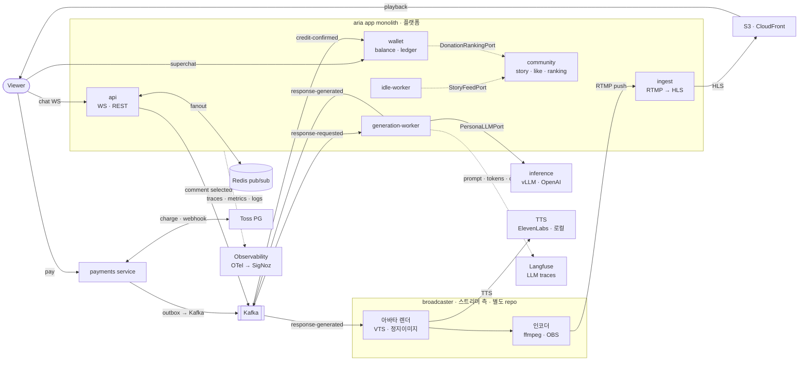

# architecture

aria(모노레포: 앱 모놀리스 + payments 서비스)의 구조와 근거. 이 repo의 설계 원본.

## 서비스 아키텍처

> GitHub이 위 Mermaid를 인라인 렌더. 렌더 이미지는 `docs/assets/architecture.png`, 소스는 `docs/assets/architecture.mmd`. 수정 후 `npx @mermaid-js/mermaid-cli -i docs/assets/architecture.mmd -o docs/assets/architecture.png -s 2`로 재렌더.

## 배포 단위 (모노레포 + 최소 MSA)

| 단위 | 무엇 | 배포 | 왜 이 경계 |
|---|---|---|---|
| **aria 모놀리스** | contexts: identity·persona·community·chat·streaming·wallet | api / generation-worker / idle-worker (같은 이미지) | 워커로 독립 스케일. wallet은 후원 핫패스라 여기 |
| **broadcaster** | 아바타 렌더 · TTS · 인코딩 | 별도 프로세스/머신 | **별도 repo.** 스트리머 PC 역할이라 aria 밖이다(inference와 같은 이유) |

> **api는 Kafka 연결을 지연으로 맺는다.** 워커(FastStream)는 프레임워크가 생명주기를 잡아 주지만 api(FastAPI)는 아니라, 연결 없이 발행하면 `IncorrectState`로 죽는다 — 실제로 띄워 보고 찾았다(포트를 가짜로 갈아끼우는 테스트들은 그 경로를 타지 않는다). startup에서 연결하지 않는 이유: Kafka가 늦게 떠도 api는 떠야 하고(채팅 말고도 하는 일이 많다), 반대로 startup에서 기다리면 브로커 없는 환경에서 기동이 막힌다.

> **generation-worker는 실체가 있다**(C-4-1). 진입점 `aria/workers/generation.py`, 실행은 `uv run faststream run aria.workers.generation:app`. api와 같은 이미지에 진입점만 다르며, 같은 consumer group 안에서 복제본을 늘리는 것이 곧 수평 확장이다. **합성 루트가 둘**인 셈인데(`app.py`와 여기), 둘 다 common과 컨텍스트를 함께 아는 자리라 common 밖 최상위에 둔다. idle-worker도 실체가 있다(아래). **media-worker는 없어졌다** — 그 일은 브로드캐스터로 나갔다.
>
> **idle 워커가 셋째 진입점이다**(`aria/workers/idle.py`, 실행 `uv run python -m aria.workers.idle`). 무채팅이 지속되면 사연을 읽거나 자율발화한다(FR-IDLE). FastStream은 메시지가 와야 깨어나므로 generation-worker에 합치지 않았다 — idle은 정반대로 "아무 일도 없을 때" 도는 타이머다.
>
> **이 워커는 DB를 안다**(방 목록·사연). "워커는 DB를 모른다"는 generation-worker의 규칙이고, idle 워커는 생성을 하지 않고 **요청만 발행**하므로 그 경계와 충돌하지 않는다.

> **수평 확장은 실측했다**(C-4-2). 실제 Kafka에서 워커 2인스턴스가 3개 파티션을 나눠 갖고 30건을 각각 23/7 처리 — 합계 30, 중복 0. 배달 보증(토픽별 ack·`msg_id` claim·DLQ)은 어댑터가 입히고 `ResponseGenerationService`는 그런 게 있는 줄 모른다. 정책은 `docs/events.md`.
| **payments 서비스** | Toss 결제 saga · outbox | 별도(별도 DB) | 경계가 이미 async, 보안/장애 격리 |
| **inference 서빙** | vLLM 멀티-LoRA | 별도 repo(GPU) | GPU 하드 경계 |
| **llmops** | 데이터셋→SFT→DPO→평가→레지스트리 | 별도 repo(GPU) | 배치·GPU |

**추출 브라이트라인**: 다른 런타임(GPU) 또는 자연 async + 강한 격리 — 이 둘만 서비스. 나머지는 프로세스 타입 스케일.

## 레이어 (Hexagonal-Lite, 컨텍스트별 수직 슬라이스)

각 컨텍스트가 자기 `domain / application(+port) / adapter`를 가진다. `common`은 공유 커널(설정·DB/Redis 클라이언트·인증(`auth`)·예외·SQLModel 믹스인·`EventBusPort`). 컴포지션 루트는 `common` 밖 `aria/app.py`(패키지 최상위)에 둔다 — common이 컨텍스트를 import하지 않도록.

`import-linter`(`apps/aria/.importlinter`)가 강제:
- 컨텍스트 내 `domain < application < adapter`
- 컨텍스트 간 **독립**(직접 import 금지, 경유는 `common` 이벤트/포트)
- `common`은 컨텍스트를 import하지 않음(커널 순수성)

`in`이 예약어라 필요 시 adapter 하위는 `inbound`/`outbound`.

### 컨텍스트 상호작용 규약

컨텍스트는 서로 import하지 않는다. 공유가 필요하면 성격에 따라 셋 중 하나로 올린다.

- **횡단 관심사 → `common`.** 인증(authN)이 대표 예: `common/auth.py`가 Bearer 토큰을 검증해 `Principal(user_id, is_staff)`를 돌려준다. 어느 컨텍스트든 identity를 몰라도 "누가 요청했나"를 얻는다. 토큰 **발급은 identity**(로그인), **검증은 common** — 같은 secret, 책임 분리.
  > **관리자 여부는 토큰 클레임(`staff`)이다.** DB에서 매번 조회하려면 common이 identity를 import해야 하는데 커널 순수성 계약이 그것을 금지한다. 기존 분업(발급=identity, 검증=common) 위에 클레임 하나를 얹는 것이 유일하게 계약을 지키는 길이다. 대가는 **권한 회수가 토큰 만료 시점에 반영**된다는 것. 관리자 전용 엔드포인트는 `require_staff` 의존성을 쓴다(예: `POST /wallet/grants`).
- **단순 참조 → 불투명 id.** 다른 컨텍스트의 엔티티는 UUID로만 참조한다(예: `persona.owner_id` = identity의 user id). 전체 객체를 끌어오지 않고, **DB에서도 cross-context FK를 걸지 않는다**(인덱스만) — 독립을 물리 스키마까지.
- **진짜 협력 → 이벤트 또는 포트.** 상태 변화 **통지**는 Kafka(`EventBusPort`)로(예: payments→wallet). 반면 즉시 답이 필요하거나(후원 차감) 조회 시점의 질문인 것(사연 claim, 열혈순위)은 **커널에 둔 동기 포트**로 한다 — 계약이 `common`에 있으면 이벤트든 포트든 컨텍스트 독립은 똑같이 지켜진다. 어느 쪽인지의 판단 근거는 `docs/events.md`.

합성 루트(`aria/app.py`)만이 common과 모든 컨텍스트를 함께 안다 — 그게 합성 루트의 일이라 common 밖 최상위에 둔다.

## 방(Room) — chat의 애그리게이트

한 페르소나의 방송 한 회차다. 채팅·후원·생성이 전부 그 위에서 일어나고, idle 루프와 미디어 송출(`hls_url`)도 이것을 전제로 한다.

- **개설은 staff 전용.** chat은 persona를 import할 수 없어 "이 페르소나가 당신 것인가"를 확인할 수 없다. 커널 포트를 하나 더 만드는 대신 PRD FR-AUTH-3("관리자는 방송·페르소나·TTS 설정을 관리한다")을 근거로 좁혔다 — 일반 사용자 호스트를 열게 되면 그때 `PersonaOwnershipPort`가 필요해지고, 그건 요구사항이 바뀌는 시점이다.
- **채팅·후원·WS는 라이브 방에서만.** 방이 생기기 전에는 `room_id`가 아무 UUID나 됐고, 그래서 존재하지 않는 방에 크레딧을 태울 수 있었다(차감은 진짜로 일어났다).
- 상태·유일성 규칙은 `docs/data-model.md`.

> 이로써 **chat api가 처음으로 DB를 갖는다**(그전까지 Redis만 썼다). 다만 **generation-worker는 계속 DB를 모른다** — 방 검증은 api에서만 하고 워커는 슬롯·생성·발행만 한다. C-4에서 세운 경계가 유지된다.

## 커뮤니티(방송국) 컨텍스트

`community` = 스트리머별 팬덤 채널의 UGC(사연 게시판·좋아요·랭킹). `persona`(AI 캐릭터 설정)와 바뀌는 이유가 달라 별도 컨텍스트.
- **Story(사연)** 는 `community`가 소유(게시판 CRUD). `chat`의 idle은 직접 import 없이 **읽기 포트/이벤트**로 pending 사연을 소비(FR-STATION-4 → FR-IDLE-2).
- **랭킹(열혈순위)** 은 테이블 없는 파생 read model이다(FR-STATION-6). 후원 금액은 `wallet`이, 후원자 표시명은 `identity`가 갖고 있고, community는 조회 시점에 둘을 합쳐 순위표를 만든다 — 직접 import 없이 커널의 **동기 읽기 포트** `DonationRankingPort`·`UserDirectoryPort`로. 배선은 합성 루트.

> 처음에는 "후원 이벤트 기반 read model"로 적어 두었으나, 그러려면 community가 자체 집계 테이블을 두고 이벤트로 갱신해야 한다. 후원은 저볼륨이고 집계는 인덱스 하나로 끝나므로, 갱신 누락이라는 정합성 문제를 새로 만들 이유가 없다. 비용은 조회 앞의 TTL 캐시가 받는다(`docs/events.md`).

## 앱 ↔ 추론 경계

> **인격은 프롬프트로, 모델 선택은 포트 뒤로.** 페르소나의 말투·가치관은 `PersonaProfilePort`로 chat에 건너와 **application이** `Message(role="system")` 하나로 합성한다(`chat/application/persona_prompt.py`). 어댑터에서 만들면 어댑터가 페르소나를 조회하게 되어 아래 경계가 한쪽에서 무너진다. LoRA가 붙어도 이 경로는 남는다 — LoRA가 말투를 잡고 시스템 프롬프트가 맥락·가치관을 준다. 그리고 이 경로로 나온 응답이 그 LoRA를 학습시킬 데이터가 된다.

`PersonaLLMPort`(`contexts/chat/application/port/out/llm.py`)가 유일한 접점. 앱은 `persona_id`만 넘기고 모델 버전을 모른다 — 버전 해석은 경계 너머 레지스트리 alias. 어댑터는 `contexts/chat/adapter/outbound/inference`. OpenAI fallback도 같은 포트 뒤.

추론 3역할(모두 OpenAI 호환 → 같은 어댑터, URL 스왑): 운영=vLLM(멀티-LoRA), fallback·로컬 dev=OpenAI, 학습·평가=transformers+trl+peft(별도 repo).

## 메시징 — 성격이 다른 둘

| | 채팅 팬아웃 | durable 이벤트 (LLM·미디어 seam · payments↔wallet) |
|---|---|---|
| 수단 | **Redis pub/sub** | **Kafka + FastStream** (`EventBusPort` 뒤) |
| 성격 | 저지연·고빈도·유실 허용 | durable·at-least-once·consumer group·outbox |

payments→wallet은 **outbox 패턴**(결제확정 + outbox 로우 로컬 트랜잭션 → relay가 Kafka 발행 → wallet 멱등 소비). 상세: `docs/events.md`.

## 실시간 송출 — **브로드캐스터와 플랫폼을 가른다**

실제 스트리밍에는 역할이 둘이다. **브로드캐스터**(스트리머 PC)가 캡처·합성·인코딩해서 RTMP로 밀고, **플랫폼**(트위치·치지직)이 ingest → 패키징 → CDN으로 시청자에게 흘린다. 채팅은 그와 별개 시스템이다.

aria는 **플랫폼**이다. AI 스트리머에게는 사람도 PC도 없으므로 브로드캐스터 역할을 대신할 것이 필요한데, **그것을 aria 안에 넣지 않고 밖으로 뺀다**.

| | 하는 일 | 어디 |
|---|---|---|
| **broadcaster** | `response-generated` 구독 → TTS → 아바타 렌더 + 자막 합성 → 인코딩 → RTMP push | **별도 repo** (inference와 같은 지위) |
| **aria (플랫폼)** | RTMP ingest → HLS 패키징 → CDN. `chat_room.hls_url` 제공. 채팅·후원·랭킹 | 이 repo |

> **왜 갈랐나.** 이전 판은 "서버합성 HLS — media-worker가 TTS + 감정별 클립 + 자막을 ffmpeg로 muxing"이었다. 그런데 그건 **스트리머 PC가 할 일을 서버 안에 밀어 넣은 것**이라, 역할 경계가 뭉개져 실제 스트리밍 구조와 어긋났다. RTMP를 경계로 두면 브로드캐스터와 플랫폼이 각각 실제와 같은 일을 한다.

> **얻는 것.** ① 고증 — 두 역할이 실제 구조 그대로 나뉜다. ② **교체 가능성** — 아바타를 정지 이미지로 하든 Live2D/VTS로 하든 **aria는 한 줄도 바뀌지 않는다**. 브로드캐스터를 갈아끼우는 일이다. ③ aria에서 ffmpeg가 사라진다. ④ 윈도우 GPU 박스(VTS·OBS)가 자연스럽게 브로드캐스터 자리에 놓인다.

> **대가.** ① RTMP→HLS는 지연이 수 초~수십 초다. 다만 **채팅이 영상보다 빠른 것도 실제 스트리밍 그대로**라 이건 오히려 고증이다. ② VTS 기반 브로드캐스터는 디스플레이 달린 머신이 켜져 있어야 한다 — 그래서 1차 브로드캐스터는 headless(정지 이미지 + ffmpeg)로 두고, VTS는 그것을 교체하는 형태로 나중에 붙인다.

시청자 수는 CDN으로 이관된다(레거시 "100명 벽" 병목 제거). 응답 사이는 브로드캐스터의 idle 루프가 채운다. 채팅·제어는 WebSocket(+Redis pub/sub 백플레인)으로 미디어와 **완전히 별개** 경로다 — 실제 플랫폼도 그렇다.

## 관측성 — 두 레이어

- 시스템: OpenTelemetry SDK(FastAPI·httpx·redis·kafka·sqlalchemy) → SigNoz. **미구현** — 아직 부하가 없어 뒤로 미뤘다(WS 구독 공유 최적화와 같은 판단).
- LLM: 토큰·비용·지연·품질을 모델 버전별 → Langfuse. **구현됨** — `TracingPort`(`common/tracing.py`) 뒤에 있고 **기본은 no-op**이라 키 없는 로컬·CI가 그대로 통과한다.

> **계측 위치가 둘이다.** 이전 판은 "생성 어댑터에서 계측"이라고 적었으나, **어댑터 혼자서는 필요한 걸 다 못 본다** — `PersonaLLMPort.generate()`는 `persona_id`와 `messages`만 받아 `room_id`·`source`·`msg_id`·프로필 유무를 모른다. 그래서 바깥 span은 **서비스**가(맥락), 안쪽 generation은 **어댑터**가(호출) 만들고 중첩된다. Langfuse의 trace/generation 모델이 정확히 이 구조다.

> **계측을 폴백 안쪽에 감싼다** — `FallbackPersonaLLM(Traced(primary), Traced(fallback))`. 바깥에 감싸면 호출 1건에 generation 1개만 남아 "주 백엔드가 실패해서 폴백했다"가 트레이스에서 사라지고 `model_version`으로만 추측하게 된다. 안쪽이면 폴백 시 generation이 **두 개** 남는다.

> **관측이 생성을 죽이지 않는다.** 백엔드가 느리거나 죽어도 방송은 계속돼야 하므로 어댑터는 어떤 예외도 밖으로 내보내지 않는다(캐시 어댑터들과 같은 방침). 켜 뒀는데 키가 없으면 경고만 남기고 no-op로 간다 — 폴백 LLM(NFR-REL-3)과 달리 관측은 없어도 서비스가 성립한다.

> **샘플링이 기본이다**(0.2). Langfuse의 과금 단위는 trace가 아니라 **observation 하나하나**(span·generation·score)라, 이 설계는 응답 1건이 3유닛쯤이다. idle 루프가 ~10초에 한 번 발화하므로 켜 두면 무료 한도(월 50k 유닛)가 빠르게 소진된다. 샘플링은 trace 단위로 적용되므로 **한 응답의 span과 generation이 같이 남거나 같이 빠진다** — 반쪽 트레이스가 생기지 않는다.

> **클라우드를 쓴다.** 자체호스팅은 컨테이너 6개(web·worker·ClickHouse·MinIO·Redis·Postgres)에 4코어/16GB 권장이라, 지금 compose(Postgres·Redis·Kafka) 위에 얹기에 무겁다. 대가는 **프롬프트·응답이 외부로 나간다**는 것 — 지금은 합성 페르소나와 테스트 사연뿐이라 감수하지만, **시청자 사연이 실제 사람의 것이 되면 자체호스팅으로 옮긴다.** 그때 코드는 바뀌지 않는다(포트 뒤 어댑터 교체).

## 데이터

- PostgreSQL(SQLModel+Alembic): aria DB(페르소나·유저·방·메시지·사연·wallet) / **payments DB 별도**(결제기록·outbox).
- Redis: 세션·큐·토픽 상태(수평확장 위해 프로세스 메모리 금지) + pub/sub.
- 상세: `docs/data-model.md`.
